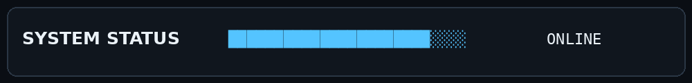

<div align="center">


### Building practical systems around crypto, Web3 and automation.

[](https://x.com/sharepluse)
[](https://github.com/BoomTwice2510)

</div>

---

## `> about`

I'm **CT**, a freelance builder focused on crypto, Web3 and automation.

I turn ideas into working products: APIs, bots, trading infrastructure, analytics, Android apps and onchain experiments.

## `> what I build`

```text
CRYPTO SYSTEMS   trading signals • execution • APIs
WEB3 TOOLS       Base • Ethereum • onchain workflows
AUTOMATION       Telegram bots • exchange APIs
BACKENDS         FastAPI • PostgreSQL • REST APIs
APPS             Android • Web • dashboards
ANALYTICS        simulation • performance • reporting
```

## `> currently building`

### ETH TRENDs
Crypto signal and automation infrastructure combining market signals, a FastAPI backend, Telegram workflows, mobile UI and exchange integrations.

`Python` `FastAPI` `PostgreSQL` `Telegram` `Binance API` `Android`

### ETHSim
Crypto simulation and analytics for testing strategies, position sizing and performance before execution.

`Python` `Analytics` `Simulation` `APIs`

### BaseFlow
Experiments around Base, onchain tooling and reputation-focused Web3 workflows.

`Base` `Ethereum` `Web3` `Smart Contracts` `Onchain Data`

## `> stack`

| Area | Tools |
|---|---|
| Languages | Python · Kotlin · JavaScript · SQL · Rust |
| Backend | FastAPI · PostgreSQL · REST APIs |
| Web3 | Ethereum · Base · Smart Contracts · Onchain APIs |
| Automation | Telegram Bots · Exchange APIs · Trading Systems |
| Frontend | Next.js · Android |
| Infrastructure | Railway · Vercel · GitHub |
| Data | DuckDB · SQLite · Analytics |

<div align="center">

</div>

## `> engineering_principles`

```text
01  Build the smallest useful version.
02  Keep the data flow observable.
03  Automate repetitive work.
04  Test the logic before trusting the output.
05  Ship, measure, improve.
```

## `> find_me`

**X:** [@sharepluse](https://x.com/sharepluse)  
**GitHub:** [BoomTwice2510](https://github.com/BoomTwice2510)

<div align="center">

`status: building`

</div>
