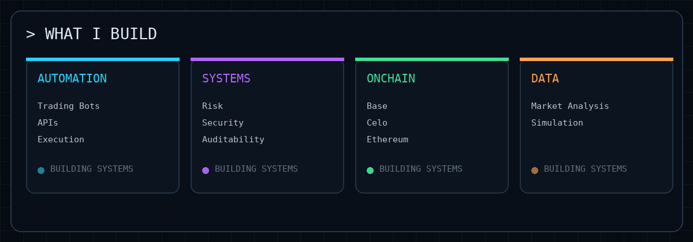
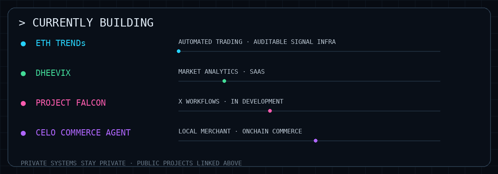
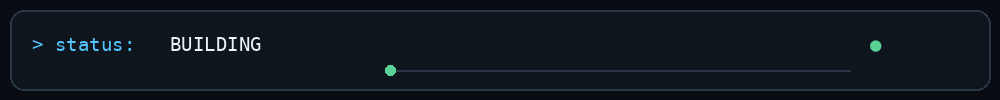

<div align="center">


### 🅒🅣 · SharePluse
**Web3 Builder · Crypto Automation · Backend Systems**

[](https://x.com/sharepluse) [](https://t.me/sharepluse) [](https://www.linkedin.com/in/oxshare/) [](https://github.com/BoomTwice2510)

</div>

---

## `> what_i_build`

<div align="center">

</div>

---

## `> selected_systems`

### ETH TRENDs · Private


**Private automated trading system for ETH.** Built around trend signals and reversal detection, with Binance auto-trading, risk and security decision controls, and auditable signal/trend-reversal data.

**System flow:** Market Data → Trend Detection → Reversal Signal → Risk / Security Engine → Binance Auto Execution → Position Monitoring → Audit Data

**Demo:** [Open ETH TRENDs](https://ethtrends.vercel.app/)

---

### Gold Bot · Private


**Private automated trading system for Gold.** Includes Binance auto-trading, risk and security decision controls, and auditable records around signals and trade activity.

**System focus:** Signal Logic → Risk / Security Decisions → Binance Auto Execution → Monitoring → Auditable Data

---

### ETHSim · Public


**ETH TRENDs simulation and analysis layer.** Built to simulate the ETH bot strategy, inspect signal behaviour, evaluate trades and study performance without live execution.

[**View source →**](https://github.com/BoomTwice2510/ETHTRENDS-Simulator) · [**Demo →**](https://ethsim.vercel.app)

---

### BaseFlow · Public


**Onchain workflow and automation project focused on practical Base ecosystem flows.**

[**View source →**](https://github.com/BoomTwice2510/baseflow) · [**Demo →**](https://baseflow-kappa.vercel.app/)

---

### Celo Commerce Agent · Public


**Onchain commerce tooling being built for local merchants.** The project explores practical Celo-based payment and merchant workflows rather than a purely experimental Web3 interface.

[**View source →**](https://github.com/BoomTwice2510/Celo-Commerce-Agent)

---

### Project Falcon · Public · In Development


**An X-focused system currently in development.** Built around creator workflows, opportunity discovery, conversation analysis, replies and content operations.

[**View source →**](https://github.com/BoomTwice2510/Project-Falcon)

---

### Dheevix · Private · Market Analytics SaaS


**Private market-analysis SaaS.** Built as a whole-market analysis platform for turning broad market data into structured analytics and useful market intelligence.

**Demo:** [Open Dheevix](https://dheevix.vercel.app)

---

## `> currently_building`

<div align="center">

</div>

---

## `> stack`

```text
LANGUAGES       Python · Kotlin · JavaScript · TypeScript · SQL · Rust
BACKEND         FastAPI · REST APIs · PostgreSQL · SQLite
WEB3            Ethereum · Base · Celo · Smart Contracts · Onchain APIs
AUTOMATION      Telegram · Exchange APIs · Workflow Systems
TRADING         Binance API · Auto Execution · Risk Controls · Audit Data
FRONTEND        Next.js · Android · HTML/CSS/JS
INFRA           Railway · Vercel · GitHub
DATA            Market Analysis · Simulation · Analytics · Event Pipelines
```

## `> build_principles`

```text
01  Build the smallest useful version.
02  Keep the data flow observable.
03  Automate repetitive work.
04  Test the logic before trusting the output.
05  Keep proprietary systems private.
06  Make important decisions auditable.
07  Ship, measure, improve.
```

<div align="center">



</div>
