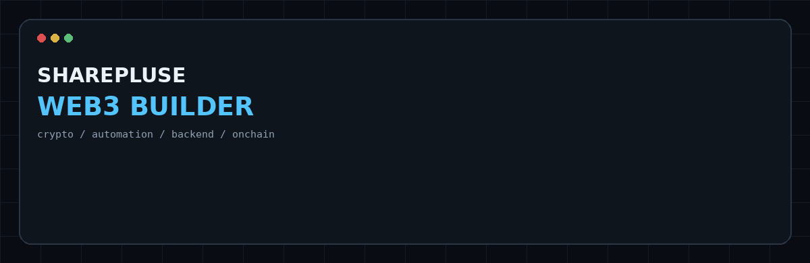
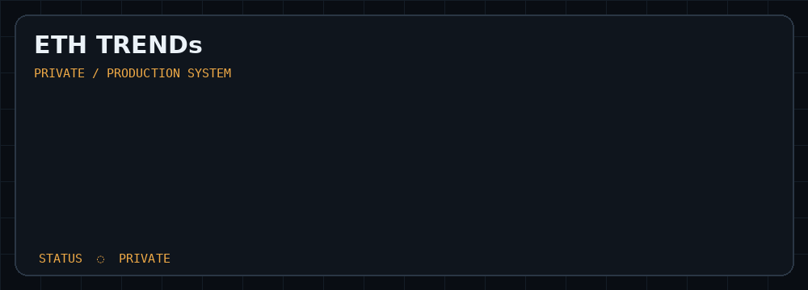
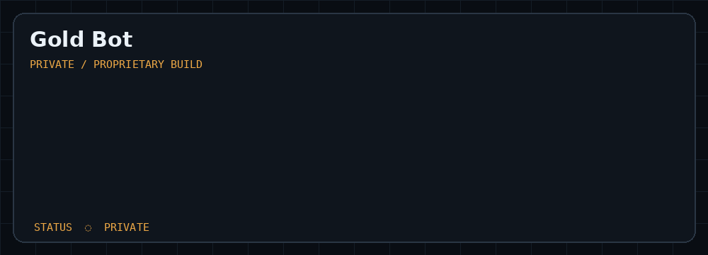
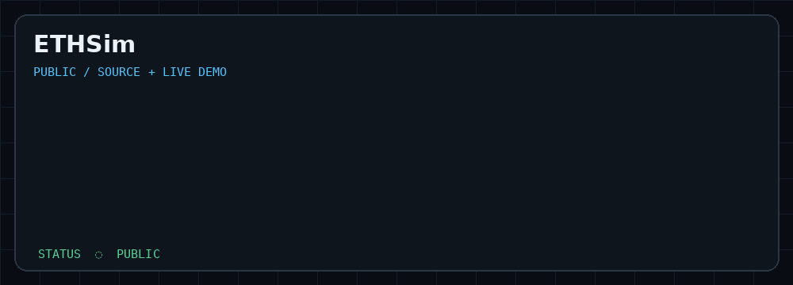
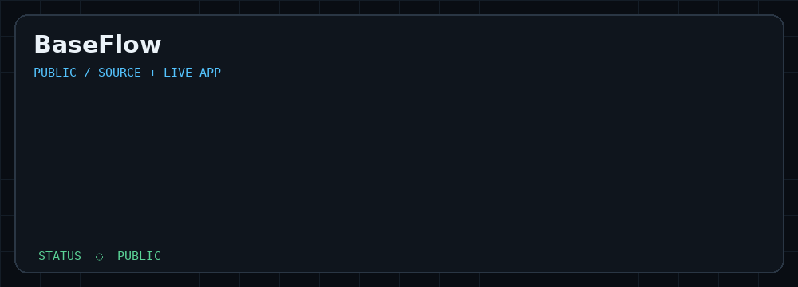
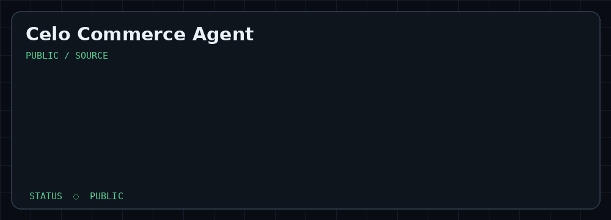
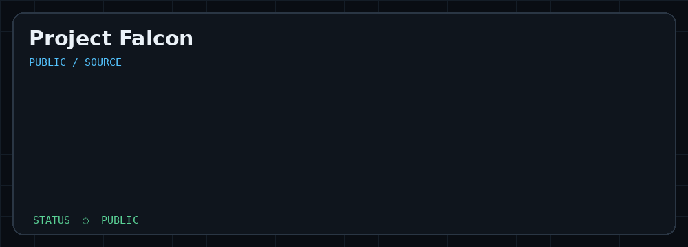
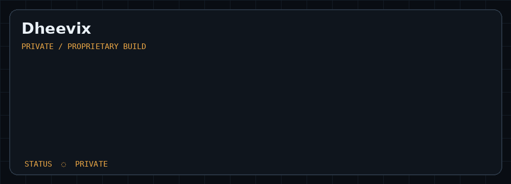

<div align="center">



### CT · SharePluse
**Web3 Builder · Crypto Automation · Backend Systems**

[](https://x.com/sharepluse) [](https://t.me/sharepluse) [](https://www.linkedin.com/in/oxshare/) [](https://github.com/BoomTwice2510)

</div>

---

## `> selected_work`

### ETH TRENDs · Private



**Private production system.** The public profile intentionally shows the product architecture, not proprietary source code.

**Core flow:** Market data → trend detection → signal engine → FastAPI backend → Telegram / Android → exchange API automation.

**Demo:** [ETH TRENDs](https://ethtrends.vercel.app/)

---

### Gold Bot · Private



**Private proprietary build.** Source and implementation details are not exposed in the public portfolio. The profile marks it as a private build rather than inventing technical details that are not public.

---

### ETHSim · Public



[**View source →**](https://github.com/BoomTwice2510/ETHTRENDS-Simulator) · [**Open demo →**](https://ethsim.vercel.app/)

A browser-based crypto simulation and analytics project for testing strategy behaviour and performance.

---

### BaseFlow · Public



[**View source →**](https://github.com/BoomTwice2510/baseflow) · [**Open app →**](https://baseflow-kappa.vercel.app/)

A modular workflow and automation framework focused on configurable execution flows, pipelines, external services and extensible architecture.

---

### Celo Commerce Agent · Public



[**View source →**](https://github.com/BoomTwice2510/Celo-Commerce-Agent)

A chat-first Celo payment agent. Natural-language requests are parsed, INR can be converted to CELO, safety limits are checked, payments are executed on Celo, and payment memory powers vendor analytics.

---

### Project Falcon · Public



[**View source →**](https://github.com/BoomTwice2510/Project-Falcon)

An AI-powered X creator operating system focused on opportunity discovery, conversation analysis, authentic replies, content creation and creator workflows.

---

### Dheevix · Private



**Private proprietary build.** Detailed implementation is kept private. The portfolio deliberately shows its status without fabricating an architecture that is not publicly documented.

**Demo:** [ETH TRENDs](https://dheevix.vercel.app/)

---

## `> stack`

```text
LANGUAGES       Python · Kotlin · JavaScript · TypeScript · SQL · Rust
BACKEND         FastAPI · REST APIs · PostgreSQL · SQLite
WEB3            Ethereum · Base · Celo · Smart Contracts · Onchain APIs
AUTOMATION      Telegram · Exchange APIs · Workflow Systems
FRONTEND        Next.js · Android · HTML/CSS/JS
INFRA           Railway · Vercel · GitHub
DATA            Analytics · Simulation · Event/Data Pipelines
```

## `> build_principles`

```text
01  Build the smallest useful version.
02  Keep the data flow observable.
03  Automate repetitive work.
04  Test the logic before trusting the output.
05  Keep proprietary systems private.
06  Ship, measure, improve.
```

<div align="center">

`status: building`

</div>
